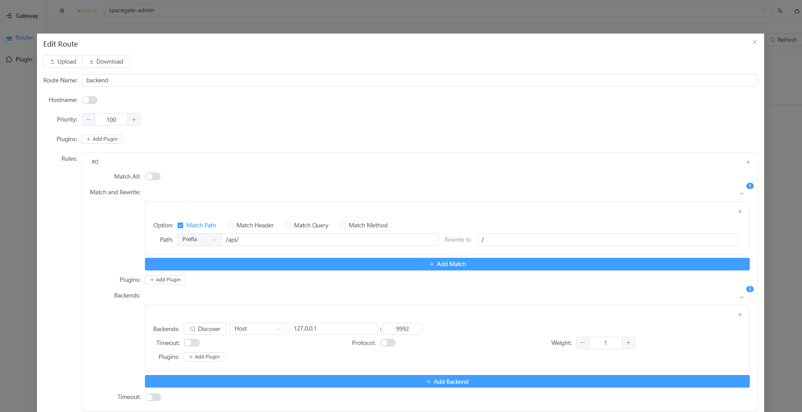

**Preview version, will not guarantee the stability of the API!
Do NOT use in production environment!**

---

**A library-first, lightweight, high-performance, cloud-native supported API gateway🪐**

---

[](https://github.com/ideal-world/spacegate/actions/workflows/cicd.yml)
[](https://github.com/ideal-world/spacegate/blob/master/LICENSE)

> SpaceGate("Spacegates are Stargates suspended in space, or in planetary orbit") From "Stargate".
# 💖 Core functions
* Tiny: based on rust, the executable file only takes 6MB.
* Cloud Native: Implemented the [Kubernetes Gateway API](https://gateway-api.sigs.k8s.io/api-types/gatewayclass/) specification.
* Easy to extent: Build your own plugin with rust in just two function.
* Easy to extent: Build your own plugin with rust in just two function.
* High performance
* Low resource usage

# Usage

## Use spacegate in k8s
### Install for kubernetes
```shell
kubectl apply -f https://github.com/ideal-world/spacegate/releases/download/0.2/spacegate-0.2.yaml
```
### Open spacegate admin web,and enjoy!


## Use spacegate as an executable binary

### Build and Install
Build and install on your own linux machine.
#### Install spacegate
```shell
sh resource/install/install.sh
```
#### Install spacegate-admin manage tool (Optional)
This official manage tool will provide you a web interface to edit gateway's config.
```shell
sh resource/install/install-admin.sh
```

#### Configure your gateway
Visit localhost:9991 if you installed spacegate-admin manage tool.
```shell
firefox localhost:9991
```
Or visit config folder
```shell
ls /etc/spacegate
```

After you edited config, use systemctl to reload config.
```shell
sudo systemctl reload spacegate
```
#### Install plugin
Check the plugin folder:
```shell
ls /lib/spacegate/plugins
```
Just and put the `.so` file under the plugin folder and configure it.
## Use spacegate as a rust lib
You can use `spacegate-kernel` or `spacegate-shell`. The The former one is relatively low-level, while the latter integrates plugins and configuration systems.
### Use `spacegate-shell`
```toml
spacegate-shell = { git="https://github.com/ideal-world/spacegate", branch="dev" }
```
Start up by a config change listener
```rust
async fn main() {
    let listener = todo!("create a listener!");
    spacegate_shell::startup(listener).await;
}
```

or just using build-in listeners
```rust
// file config
spacegate_shell::startup_file("/etc/spacegate").await;
// k8s resource
spacegate_shell::startup_k8s(Some("spacegate-namespace")).await;
// fetch from redis
spacegate_shell::startup_redis("redis://my-redis").await;
```

### Use `spacegate-kernel`
```toml
spacegate-kernel = { git="https://github.com/ideal-world/spacegate", branch="dev" }
```
Create a listener and a gateway service
```rust
let cancel = CancellationToken::default();
// create a gateway service
let gateway = gateway::Gateway::builder("test_gateway")
    .http_routers([(
        "test_gateway".to_string(),
        HttpRoute::builder()
            .rule(
                HttpRouteRule::builder()
                    .match_item(HttpPathMatchRewrite::prefix("/baidu"))
                    .backend(HttpBackend::builder().schema("https").host("www.baidu.com").port(443).build())
                    .build(),
            )
            .build(),
    )])
    .build();
let addr = SocketAddr::from_str("[::]:9002")?;
// create a listener
let listener = SgListen::new(
    addr,
    gateway.as_service(),
    cancel.child_token(),
);
// start listen
listener.listen().await?;
```

## Create your own plugins in rust
All you need to do is to implements a `Plugin` trait
```rust
use spacegate_plugin::{SgResponse, SgRequest, Inner, BoxError, PluginConfig, Plugin};

pub struct ServerHeaderPlugin {
    header_value: String,
}

impl Plugin for ServerHeaderPlugin {
    // an unique code for this plugin
    const CODE: &'static str = "server-header";
    // this will be called when request passthrough this plugin
    async fn call(&self, req: SgRequest, inner: Inner) -> Result<SgResponse, BoxError> {
        // pre-request process

        // call inner to pass this request into inner layers
        let mut resp = inner.call(req).await;    

        // post-request process
        resp.headers_mut().insert("server", self.header_value.parse()?);

        // return the result
        Ok(resp)
    }

    // create a plugin instance from config
    fn create(plugin_config: PluginConfig) -> Result<Self, BoxError> {
        let Some(header_value) = plugin_config.spec.get("header_value") else {
            return Err("missing header_value".into())
        };
        Ok(Self {
           header_value: header_value.as_str().unwrap_or("spacegate").to_string(),
        })
    }
}
```
### Use the plugin as a static lib
In your application program.
```rust
// register the plugin into global plugin repository
spacegate_plugin::PluginRepository::global().register::<ServerHeaderPlugin>()
```

### Use the plugin as a dynamic linked lib
Use the macro `dynamic_lib`
```rust
use spacegate_plugin::dynamic_lib;
dynamic_lib! { ServerHeaderPlugin }
```
and set the crate-type to `dylib`

```toml
[lib]
crate-type = ["dylib"]
```

After you got the lib file, load it in application program.

For example:
```rust
spacegate_plugin::PluginRepository::global().register_dylib("/lib/spacegate/plugins/mylib.so")
```

# Why create this project

There are a lot of API gateway products out there, but they are mostly in the form of standalone services. The customization ability is relatively poor, and the cost of using and deploying is relatively high.

This project is based on the ``Rust`` language and uses ``hyper`` as the base network library. The goal is to: **provide a library-first, lightweight, high-performance, cloud-native supported API gateway** .


# 📦 Components

| Crate                         | Type | Description                                                                        | 
|-------------------------------|------|------------------------------------------------------------------------------------|
| **spacegate-kernel** [](https://crates.io/crates/spacegate-kernel) [](https://docs.rs/spacegate-kernel) | rust-lib  | Kernel functions for creating a gateway service |
| **spacegate-shell** [](https://crates.io/crates/spacegate-shell) [](https://docs.rs/spacegate-shell) | rust-lib  | Integrated collection including a plugin system, config listeners and a easy-to-use program entrance. |
| **spacegate-plugin** [](https://crates.io/crates/spacegate-plugin) [](https://docs.rs/spacegate-plugin) | rust-lib  | A plugin system implementation for  spacegate-shell. |
| **spacegate-model** [](https://crates.io/crates/spacegate-model) [](https://docs.rs/spacegate-model) | rust-lib  | Common data structures in spacegate project. |
| **spacegate-config** [](https://crates.io/crates/spacegate-config) [](https://docs.rs/spacegate-config) | rust-lib  | Config listener interface and implementations. |
| **spacegate** | bin  | An out-of-box executable based on spacegate-shell. |
| **spacegate-admin** | bin  | Spacegate admin application backend service. |
| **spacegate-admin-client** | js-lib  | JavaScript/TypeScript sdk for spacegate-admin. |
| **spacegate-admin-fe** | web  | Spacegate admin front end. |
## Project Structure



## 🔖 Releases
> Release binary naming method: {crate}-{arch}{OS}{abi}-{version}
> [download here](https://github.com/ideal-world/spacegate/releases/latest)

| OS          | Arch                   | abi           | Remark                                       |
|-------------|------------------------|---------------|----------------------------------------------|
| **linux**   | **x86_64**,**aarch64** | **gnu,musl**  | If you need static linking please use `musl` |
<!-- | **macos**   | **x86_64**,**aarch64** | **Libsystem** |                                              |
| **windows** | **x86_64**             | **msvc**      |                                              | -->

